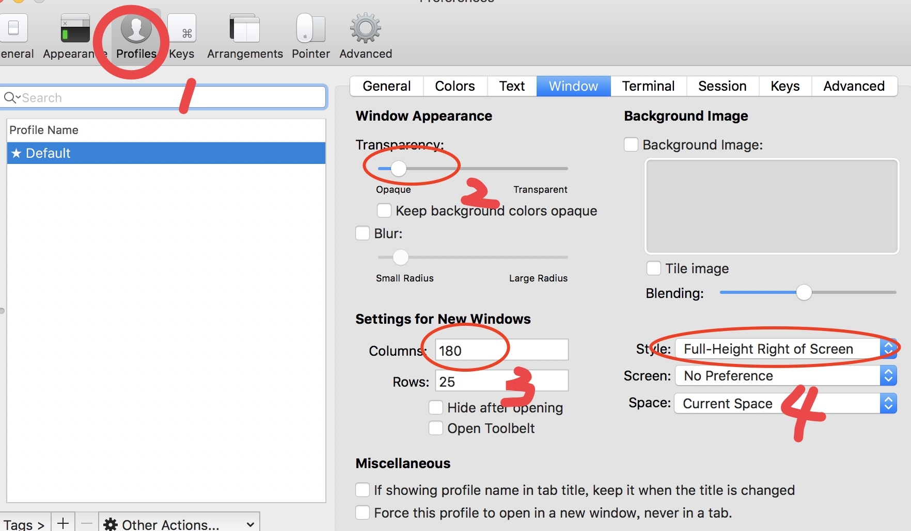

# React 脚手架

### 安装

1. 安装`homebrew `--安装工具,`oymyzsh`--shell美化

``` bash
# 安装homebrew
/usr/bin/ruby -e "$(curl -fsSL https://raw.githubusercontent.com/Homebrew/install/master/install)"
# 安装ohmyzsh
sh -c "$(curl -fsSL https://raw.github.com/robbyrussell/oh-my-zsh/master/tools/install.sh)"
```

1. 安装`iterm2`[点击下载](https://iterm2.com/downloads/stable/latest)
    
    
1. 使用`homebrew`安装`nodejs` 
``` bash
brew install nodejs
```

1. 克隆本项目并安装

``` bash
git clone http://git.tederen.com/inu1255/react-starter.git
cd react-starter
npm install
npm start
```

1. 项目结构

``` 
dist 发布文件夹
mock 模拟接口
src 代码目录
--- routes     页面组件
--- components 零件组件
--- utils      工具方法/配置文件
--- service    接口类
```

### storage使用方法

当一个组件的操作影响其它组件的状态时，将状态保存在storage中。storage有命名空间，如"app"，connect同样命名空间的组件，在dispach时都会更新
```
import React from 'react';
import { connect } from 'asha/libs/storage.js';
import classnames from "classnames/bind"
const cx = classnames.bind(styles)

class App extends React.Component {
    constructor(props) {
        super(props)
        this.displayName = 'App'
        this.state = {}
    }
    render() {
        return (
            <div onClick={this.props.dispach({count:this.props.count+1})} className={cx("app-container")}>
                {this.props.count}
            </div>
        )
    }
}

export default connect("app")(App)

```
调用`this.props.dispatch({},true)` 更新组件的同时将命名空间如"app"中的数据保存到localstorage中


storage 的初始化在 src/storage/init.js中，将命名空间"app"中的数据初始化，但是如果localstorage中有数据，始化时会优先使用localstorage中的数据
``` javascript
import storage from 'asha/libs/storage.js'

storage.register("app", {
    count:10
})
```

### 参考资料

组件库 [ant-design](https://ant.design/docs/react/introduce-cn)

路由 [react-router](https://github.com/ReactTraining/react-router)